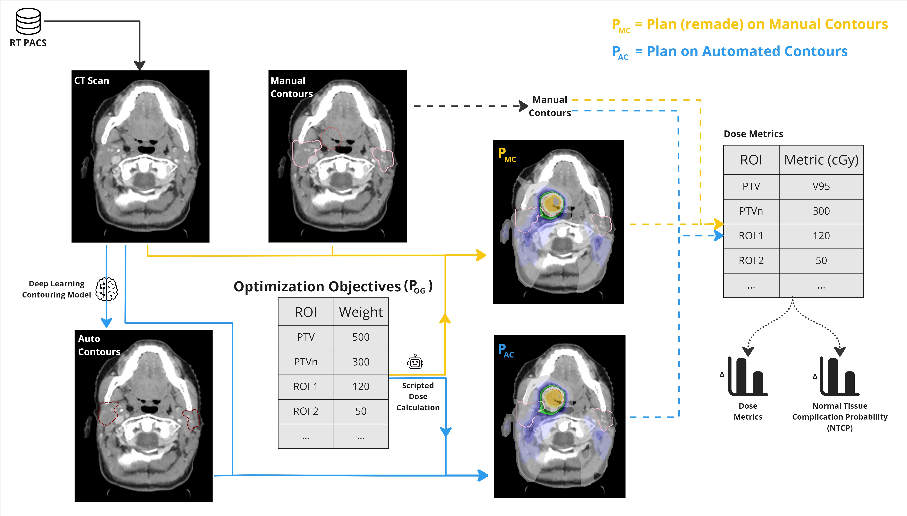

# Intro
This repository provides python scripts for head-and-neck photon and proton radiotherapy planning (in Raystation). It produces results for the paper - "Large-scale dose evaluation of deep learning organ contours in head-and-neck radiotherapy by leveraging existing plans" (under review).

# Abstract
**Background and Purpose**: Retrospective dose evaluation for organ-at-risk auto-contours has previously used small cohorts due to additional manual effort required for treatment planning on auto-contours. We aim to do this at large scale, by a) proposing and assessing an automated plan optimization workflow that uses existing clinical plan parameters and b) using it for head-and-neck auto-contour dose evaluation.

**Materials and Methods**: Our automated workflow emulates our clinics treatment planning protocol and reuses existing clinical plan optimization parameters. This workflow recreates the original clinical plan (P<sub>OG</sub>) with manual contours (Pmc) and evaluates the dose effect (P<sub>OG</sub> − P<sub>MC</sub>) on 70 photon and 30 proton plans of head-and-neck patients. As a use-case, the same workflow (and parameters) creates a plan using auto-contours (P<sub>AC</sub>) of eight head-and-neck organs-at-risk from a commercial tool and evaluates their dose effect (P<sub>MC</sub> − P<sub>AC</sub>).

**Results**: For plan recreation (P<sub>OG</sub> − P<sub>MC</sub>), our workflow, has a median impact of 0.99% and 1.45%, across dose metrics of auto-contours, for photon and proton, respectively. Computer time of automated planning is 25% (photon) and 42% (proton) of manual
planning time. For auto-contour evaluation (P<sub>MC</sub> − P<sub>AC</sub>), we notice an impact of 2.01% and 2.58% for photon and proton radiotherapy. All evaluations have a median ∆NTCP less than 0.30%.

**Conclusions**: The plan replication capability of our automated program provides a blueprint for other clinics to perform auto-contour dose evaluation with large patient cohorts and minimal skill and resource requirements. Finally, in spite of geometric differences, auto-contours, have a minimal mediandose impact, hence inspiring confidence in their utility and facilitating their clinical adoption.

# Method



# Scripts

## Installation
Within the Raystation python 3.6 environment, run the following command to install the required packages.
```bash
pip install pydicom
```

1. For photons
    - [src/hnDosePhotons.py](src/hnDosePhotons.py)

2. For protons
    - [src/hnDoseProtons.py](src/hnDoseProtons.py)

3. Other files
    - [src/config.py](src/config.py)
    - [src/helpers.py](src/helpers.py)